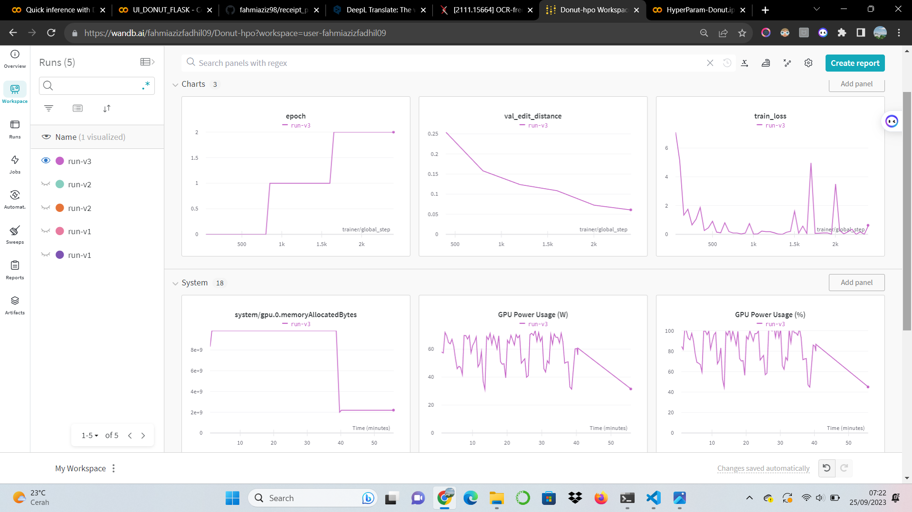

# Receipt Parsing

This project demonstrates how to use the Donut model with CORD dataset to perform receipt parsing. Receipt parsing involves extracting structured information from photographed receipts, such as itemized lists and totals.

## Overview

- The [CORD](https://huggingface.co/datasets/naver-clova-ix/cord-v2) dataset is a collection of receipts and invoices with ground truth annotations.
- We leverage the power of [Hugging Face Transformers](https://huggingface.co/transformers/) to fine-tune a pre-trained [Donut](https://huggingface.co/naver-clova-ix/donut-base) model for receipt parsing.
- The model used in this project is `fahmiaziz/finetune-donut-cord-v2.5`, which is adapted to the CORD-V2 dataset you can see it [here](https://huggingface.co/fahmiaziz/finetune-donut-cord-v2.5).
## Requirements

To run this project, you need:

- Python 3.7+
- PyTorch
- [Hugging Face Transformers](https://huggingface.co/transformers/)
- [Pillow](https://pillow.readthedocs.io/en/stable/)
- [flask](https://flask.palletsprojects.com/en/2.3.x/installation/#install-flask)

## Model Training and Evaluation

We trained and evaluated our receipt parsing model using the Donut model with CORD-V2 dataset. The goal was to achieve a high accuracy of 90% or above. You can access the detailed training and evaluation results on Weights & Biases (WandB):

- [Model Training and Evaluation Dashboard](https://wandb.ai/fahmiazizfadhil09/Donut-hpo)

Here are some highlights from the training and evaluation process:

- **Dataset**: We used the CORD dataset, which includes a diverse collection of receipts and invoices.

- **Model**: Our model is based on the `fahmiaziz/finetune-donut-cord-v2.5` architecture, fine-tuned specifically for receipt parsing.

- **Training Metrics**: During training, we monitored various metrics, including accuracy, Tree Edit Distance (Tree ED) to ensure the model's performance.

- **Evaluation**: Our model achieved an accuracy of over 90% on the test dataset, demonstrating its effectiveness in parsing receipts.

- **Visualization**: The training and evaluation process can be visualized through the WandB dashboard linked above.

Feel free to explore the training details and evaluation results on WandB for more insights into our model's performance.

